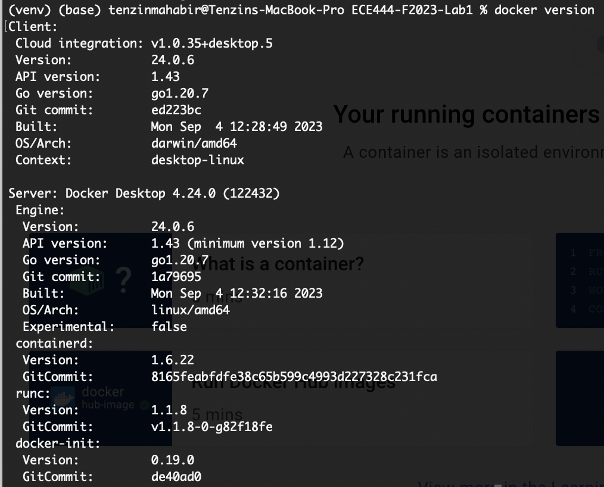
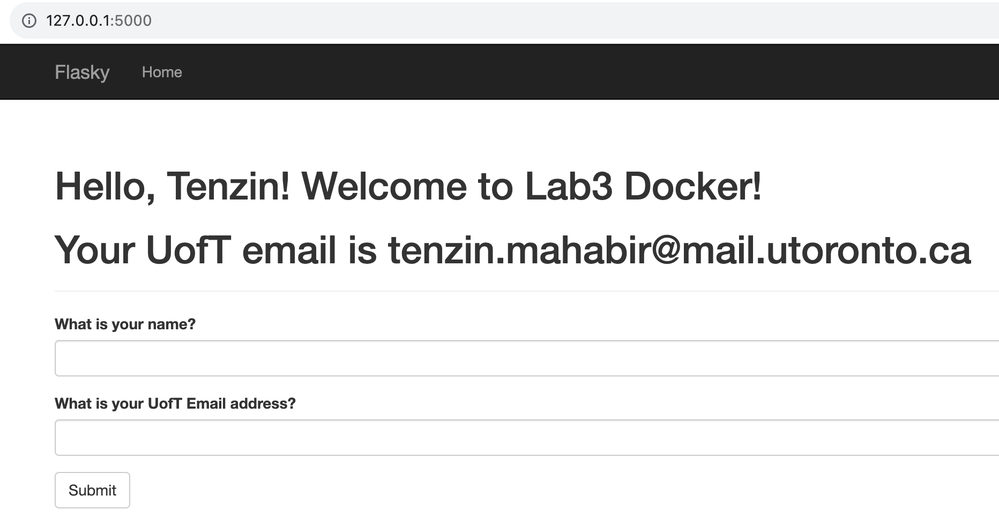
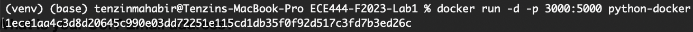
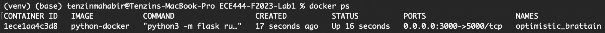
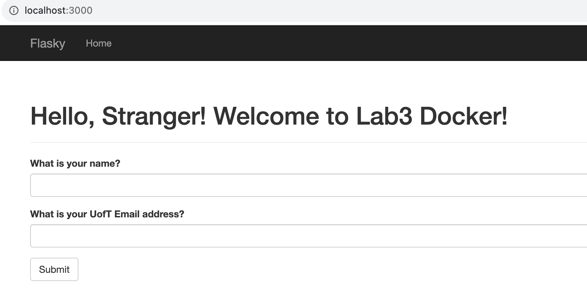

# ECE444-F2023-Lab3 - Tenzin Mahabir
This repo is a clone of https://github.com/miguelgrinberg/flasky.

# Activity 1

Branched from main of Lab1 repo and then cleaned up README

# Activity 2

# Activity 3

# Activity 4

